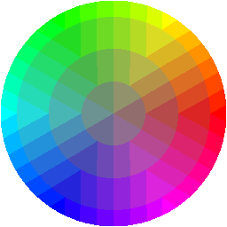

# Table of Contents

   1. [Introduction](#introduction)
   1. [Two Bits](#two-bits)
   2. [Three Bits](#three-bits)
   3. [Four Bits](#four-bits)
   4. [Five Bits](#five-bits)
   5. [Six Bits](#six-bits)

## Introduction

This is a fork of [WolftrooperNo86](https://github.com/WolftrooperNo86)'s [FastBit](https://github.com/WolftrooperNo86/FastBit) Lua script for [Aseprite](https://www.aseprite.org/), a pixel art editor. For general information on how to install a script in Aseprite, see [the documentation](https://www.aseprite.org/docs/scripting/); for the scripting API, see this [Github repo](https://github.com/aseprite/api). For discussion about the original script in the Aseprite community forum, see this [thread](https://community.aseprite.org/t/script-fastbit-color-picker-v1-2/5687).

_This script was tested in Aseprite version 1.3-beta-5._

I have refactored the code for general readability and maintainability.

Color bit-depth can now be changed without separate dialog windows. There are no plans to support uniform control over RGB bit-depth.

 The dialog no longer concerns itself whether a sprite is open or what its color mode is. This can result in a [bug](https://github.com/aseprite/api/issues/56) where opening the color picker while a grayscale sprite is active will lead to gray colors in the preview. Even so, I feel this is worth the trade-off. Furthermore, remember that a sprite's color management profile may impact either the appearance or the numberical values of a color.

Foreground and background colors are no longer updated by the dialog; this is to avoid overwriting color entries in unlocked palettes As seen in the screen capture above, the underlined letters on the buttons show that `Alt+F` gets the foreground color; `Alt+B`, the background color; `Alt+W` creates a new sprite with a color wheel; `Alt+C` closes the dialog. You can left click on the color preview to assign to the foreground color; right click, to the background color. You can also copy and paste the hexadecimal code. 

The HSL color wheel is not guaranteed to give you every color available for the selected channel bit-depths. The number of frames to animate the lightness of the color wheel is based on the maximum bit-depth for red, green and blue channels. HSL is not perceptually uniform. It is used only because it is popular and is built-in. See instead [HSLuv](https://www.hsluv.org/) or [LCH](https://css.land/lch/).

The palette assigned to the sprite containing the color wheel is clamped to 256 maximum. Index 0 is set to the alpha mask. There's no point in using Aseprite's palette creation algorithms, as the condensed palette will not preserve bit-depth safe colors. 

I am still researching the proper expansions from low bit to standard RGB. The tables below are diagnostic print-outs for both myself and for interested readers to compare this script's outputs against other standards and palettes. The one, seven and eight bit tables are omitted. I count the number of bits per _one_ color channel, so readers may need to multiply by three to match other naming conventions. For example, "five bits" would be "fifteen bit RGB." Differences are included in cases where 256 - 1 divided by the number of steps - 1 does not yield an integer quotient.

## Two Bits
`2 ^ 2 = 4`, `1 << 2 = 4`, `255 / (4 - 1) = 85`

`4 ^ 3 = 64` possible colors

[https://en.wikipedia.org/wiki/List_of_monochrome_and_RGB_color_formats#6-bit_RGB](https://en.wikipedia.org/wiki/List_of_monochrome_and_RGB_color_formats#6-bit_RGB)*

Step|Decimal|Hex|
---:|------:|--:|
0|0|00
1|85|55
2|170|AA
3|255|FF

*The reference image contains channel values such as `1` and `171` (`AB`).

## Three Bits
`2 ^ 3 = 8`, `1 << 3 = 8`, `255 / (8 - 1) = 36.42857142857143`

`8 ^ 3 = 512` possible colors

[https://en.wikipedia.org/wiki/List_of_monochrome_and_RGB_color_formats#9-bit_RGB](https://en.wikipedia.org/wiki/List_of_monochrome_and_RGB_color_formats#9-bit_RGB)

Step|Decimal|Hex|Diff|
---:|------:|--:|---:|
0|0|00|
1|36|24|36
2|73|49|37
3|109|6D|36
4|146|92|37
5|182|B6|36
6|219|DB|37
7|255|FF|36

## Four Bits
`2 ^ 4 = 16`, `1 << 4 = 16`, `255 / (16 - 1) = 17`

`16 ^ 3 = 4096` possible colors

[https://en.wikipedia.org/wiki/List_of_monochrome_and_RGB_color_formats#12-bit_RGB](https://en.wikipedia.org/wiki/List_of_monochrome_and_RGB_color_formats#12-bit_RGB)

Step|Decimal|Hex|
---:|------:|--:|
0|0|00
1|17|11
2|34|22
3|51|33
4|68|44
5|85|55
6|102|66
7|119|77
8|136|88
9|153|99
10|170|AA
11|187|BB
12|204|CC
13|221|DD
14|238|EE
15|255|FF

## Five Bits
`2 ^ 5 = 32`, `1 << 5 = 32`, `255 / (32 - 1) = 8.225806451612903`

`32 ^ 3 = 32768` possible colors

[https://en.wikipedia.org/wiki/List_of_monochrome_and_RGB_color_formats#15-bit_RGB](https://en.wikipedia.org/wiki/List_of_monochrome_and_RGB_color_formats#15-bit_RGB)*

Step|Decimal|Hex|Diff|
---:|------:|--:|---:|
0|0|00|
1|8|08|8
2|16|10|8
3|25|19|9
4|33|21|8
5|41|29|8
6|49|31|8
7|58|3A|9
8|66|42|8
9|74|4A|8
10|82|52|8
11|90|5A|8
12|99|63|9
13|107|6B|8
14|115|73|8
15|123|7B|8
16|132|84|9
17|140|8C|8
18|148|94|8
19|156|9C|8
20|165|A5|9
21|173|AD|8
22|181|B5|8
23|189|BD|8
24|197|C5|8
25|206|CE|9
26|214|D6|8
27|222|DE|8
28|230|E6|8
29|239|EF|9
30|247|F7|8
31|255|FF|8

*There are numerous discrepancies between the refactor, the original fast bit script and the Wikipedia reference. A formula specific to the SNES palette can be found at [https://wiki.superfamicom.org/palettes](https://wiki.superfamicom.org/palettes).

## Six Bits
`2 ^ 6 = 64`, `1 << 6 = 64`, `255 / (64 - 1) = 4.047619047619048`

`64 ^ 3 = 262144` possible colors

[https://en.wikipedia.org/wiki/List_of_monochrome_and_RGB_color_formats#18-bit_RGB](https://en.wikipedia.org/wiki/List_of_monochrome_and_RGB_color_formats#18-bit_RGB)

Step|Decimal|Hex|Diff|
---:|------:|--:|---:|
0|0|00|
1|4|04|4
2|8|08|4
3|12|0C|4
4|16|10|4
5|20|14|4
6|24|18|4
7|28|1C|4
8|32|20|4
9|36|24|4
10|40|28|4
11|45|2D|5
12|49|31|4
13|53|35|4
14|57|39|4
15|61|3D|4
16|65|41|4
17|69|45|4
18|73|49|4
19|77|4D|4
20|81|51|4
21|85|55|4
22|89|59|4
23|93|5D|4
24|97|61|4
25|101|65|4
26|105|69|4
27|109|6D|4
28|113|71|4
29|117|75|4
30|121|79|4
31|125|7D|4
32|130|82|5
33|134|86|4
34|138|8A|4
35|142|8E|4
36|146|92|4
37|150|96|4
38|154|9A|4
39|158|9E|4
40|162|A2|4
41|166|A6|4
42|170|AA|4
43|174|AE|4
44|178|B2|4
45|182|B6|4
46|186|BA|4
47|190|BE|4
48|194|C2|4
49|198|C6|4
50|202|CA|4
51|206|CE|4
52|210|D2|4
53|215|D7|5
54|219|DB|4
55|223|DF|4
56|227|E3|4
57|231|E7|4
58|235|EB|4
59|239|EF|4
60|243|F3|4
61|247|F7|4
62|251|FB|4
63|255|FF|4